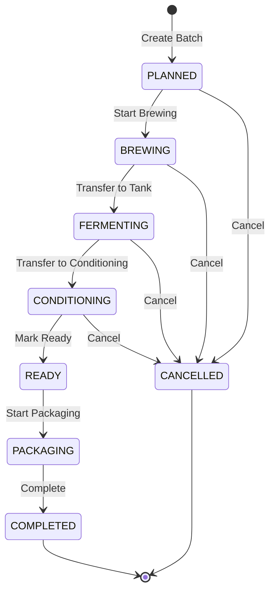
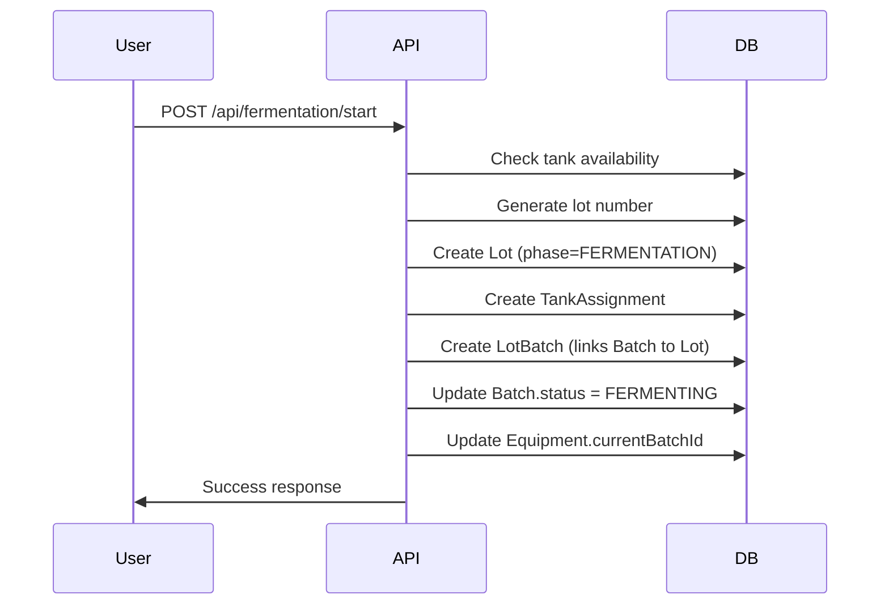

# Brewery SaaS Platform - Architecture Documentation

> **Last Updated**: 2025-01-27  
> **Project**: Multi-tenant SaaS Platform for Brewery Management  
> **Tech Stack**: Next.js 14, TypeScript, Prisma, PostgreSQL, Zustand, Tailwind CSS

---

## Table of Contents

1. [Project Structure](#1-project-structure)
2. [Database Schema](#2-database-schema)
3. [API Routes](#3-api-routes)
4. [Frontend Architecture](#4-frontend-architecture)
5. [Business Logic Flows](#5-business-logic-flows)
6. [State Management](#6-state-management)
7. [Known Issues & Technical Debt](#7-known-issues--technical-debt)

---

## 1. Project Structure

### 1.1 Monorepo Configuration

The project uses a **Turborepo + pnpm workspaces** setup:

```yaml
# pnpm-workspace.yaml
packages:
  - "apps/**"
  - "packages/**"
```

**Build System**: Turbo with dependency-aware task execution  
**Package Manager**: pnpm 8.15.0  
**Node Version**: >=18

### 1.2 Directory Structure

```
saas-platform/
├── apps/
│   ├── brewery/          # Main brewery management app
│   ├── hotel/            # Hotel PMS module
│   ├── restaurant/       # Restaurant module
│   ├── web/
│   │   ├── landing/      # Marketing site
│   │   └── super-admin/  # Platform admin
│   └── winery/           # Winery module (planned)
│
├── packages/
│   ├── auth/             # Authentication & RBAC
│   ├── database/         # Prisma schema & client
│   ├── brewery-domain/   # Domain logic & services
│   ├── ui/               # Shared UI components (shadcn/ui)
│   ├── types/            # Shared TypeScript types
│   ├── utils/            # Utility functions
│   ├── config/           # Shared configurations
│   ├── observability/    # Logging, metrics (Sentry)
│   └── redis/            # Redis client & idempotency
│
├── docs/                 # Documentation
├── turbo.json           # Turborepo configuration
└── package.json         # Root package.json
```

### 1.3 Package Dependencies

| Package | Dependencies | Used By |
|---------|-------------|---------|
| `@saas-platform/database` | Prisma Client | All apps |
| `@saas-platform/auth` | NextAuth, RBAC | All apps |
| `@saas-platform/ui` | React, Tailwind | All apps |
| `@brewery/domain` | Business logic | brewery app |
| `@saas-platform/types` | TypeScript types | All apps |

### 1.4 Turborepo Pipeline

```json
{
  "pipeline": {
    "build": { "dependsOn": ["^build"] },
    "dev": { "cache": false, "persistent": true },
    "lint": { "dependsOn": ["^lint"] },
    "type-check": { "dependsOn": ["^type-check"] },
    "db:generate": { "cache": false },
    "db:push": { "cache": false }
  }
}
```

---

## 2. Database Schema

### 2.1 Overview

**Database**: PostgreSQL  
**ORM**: Prisma 5.22.0  
**Location**: `packages/database/prisma/schema.prisma`

### 2.2 Core Models

#### Tenant (Multi-tenancy)
```prisma
model Tenant {
  id        String   @id @default(cuid())
  name      String
  slug      String   @unique
  plan      PlanType @default(STARTER)
  isActive  Boolean  @default(true)
  // Relations to all tenant-scoped models
}
```

#### Batch (Production Batches)
```prisma
model Batch {
  id                    String      @id @default(cuid())
  tenantId              String
  batchNumber           String
  recipeId              String
  status                BatchStatus @default(PLANNED)
  volume                Decimal
  originalGravity       Decimal?
  currentGravity        Decimal?
  finalGravity          Decimal?
  abv                   Decimal?
  tankId                String?
  
  // Timestamps
  plannedDate           DateTime
  brewedAt              DateTime?
  fermentationStartedAt DateTime?
  conditioningStartedAt DateTime?
  readyAt               DateTime?
  completedAt           DateTime?
  
  // Relations
  recipe      Recipe
  tank        Tank?
  ingredients BatchIngredient[]
  timeline    BatchTimeline[]
  LotBatch    LotBatch[]
}
```

**Batch Status Flow**:
```
PLANNED → BREWING → FERMENTING → CONDITIONING → READY → PACKAGING → COMPLETED
                                                    ↓
                                                CANCELLED (can occur at any stage)
```

#### Lot (Fermentation Lots)
```prisma
model Lot {
  id        String   @id
  tenantId  String
  lotNumber String
  phase     LotPhase @default(FERMENTATION)
  status    LotStatus @default(PLANNED)
  
  // Relations
  LotBatch        LotBatch[]
  TankAssignment  TankAssignment[]
  Transfer        Transfer[]
}
```

**Lot Phases**:
- `FERMENTATION` - Active fermentation
- `CONDITIONING` - Cold conditioning/maturation
- `BRIGHT` - Ready for packaging
- `PACKAGING` - Currently being packaged

#### TankAssignment (Tank Scheduling)
```prisma
model TankAssignment {
  id            String           @id
  tenantId      String
  tankId        String           // Equipment.id
  lotId         String
  phase         LotPhase
  status        AssignmentStatus @default(PLANNED)
  plannedVolume Decimal
  actualVolume  Decimal?
  startTime     DateTime
  endTime       DateTime
  
  // Relations
  Equipment Equipment
  Lot       Lot
}
```

**Assignment Status**:
- `PLANNED` - Scheduled but not started
- `ACTIVE` - Currently in use
- `COMPLETED` - Finished
- `CANCELLED` - Cancelled before completion

#### Equipment (Tanks & Brewhouse)
```prisma
model Equipment {
  id                     String   @id
  tenantId               String
  name                   String
  type                   String?  // KETTLE, FERMENTER, BRITE, etc.
  status                 String?  @default("OPERATIONAL")
  capacity               Float?
  currentBatchId         String?
  
  // Relations (PascalCase in schema!)
  TankAssignment   TankAssignment[]
  MaintenanceLog   MaintenanceLog[]
  CIPLog          CIPLog[]
  ProblemReport   ProblemReport[]
}
```

**⚠️ CRITICAL**: Relation fields in Prisma schema use **PascalCase** (e.g., `TankAssignment`, `Lot`, `LotBatch`), but Prisma Client generates camelCase accessors. In `include` statements, use **PascalCase**.

#### InventoryItem & InventoryLedger
```prisma
model InventoryItem {
  id            String   @id
  tenantId      String
  sku           String
  name          String
  category      InventoryCategory
  cachedBalance Decimal  @default(0)
  // ...
  ledger        InventoryLedger[]
}

model InventoryLedger {
  id          String          @id
  tenantId    String
  itemId      String
  quantity    Decimal
  type        LedgerEntryType  // PURCHASE, CONSUMPTION, PRODUCTION, etc.
  batchId     String?
  // ...
}
```

### 2.3 Enums

| Enum | Values |
|------|--------|
| `BatchStatus` | PLANNED, BREWING, FERMENTING, CONDITIONING, READY, PACKAGING, COMPLETED, CANCELLED |
| `LotPhase` | FERMENTATION, CONDITIONING, BRIGHT, PACKAGING |
| `AssignmentStatus` | PLANNED, ACTIVE, COMPLETED, CANCELLED |
| `LedgerEntryType` | PURCHASE, CONSUMPTION, PRODUCTION, ADJUSTMENT, WASTE, SALE, RETURN |
| `UserRole` | OWNER, ADMIN, MANAGER, OPERATOR, VIEWER |
| `PlanType` | STARTER, PROFESSIONAL, ENTERPRISE |

### 2.4 Relation Naming Conventions

**⚠️ IMPORTANT**: Prisma schema uses **PascalCase** for relation field names, but Prisma Client generates camelCase accessors for runtime. However, in `include`/`select` statements, you **must use PascalCase** as defined in the schema.

**Example**:
```typescript
// ✅ CORRECT - Use PascalCase in queries
const equipment = await prisma.equipment.findMany({
  include: {
    TankAssignment: {  // PascalCase!
      include: {
        Lot: {         // PascalCase!
          select: {
            LotBatch: { // PascalCase!
              include: {
                Batch: true
              }
            }
          }
        }
      }
    }
  }
})

// ❌ WRONG - camelCase will fail
include: {
  tankAssignments: { ... }  // TypeScript error!
}
```

**Then transform to camelCase for frontend**:
```typescript
const transformed = equipment.map(eq => ({
  ...eq,
  tankAssignments: eq.TankAssignment,  // Transform to camelCase
  TankAssignment: undefined
}))
```

---

## 3. API Routes

### 3.1 Overview

**Total Routes**: 57 route files  
**Total Endpoints**: ~75 HTTP handlers (GET, POST, PUT, DELETE)  
**Base Path**: `/api`  
**Framework**: Next.js 14 App Router

### 3.2 Authentication & Authorization

All routes use `withTenant()` or `withPermission()` middleware:

```typescript
// lib/api-middleware.ts
export function withTenant<T>(
  handler: (req: NextRequest, ctx: RouteContext) => Promise<NextResponse<T>>
)

export function withPermission<T>(
  permission: Permission,
  handler: (req: NextRequest, ctx: RouteContext) => Promise<NextResponse<T>>
)
```

**RouteContext**:
```typescript
interface RouteContext {
  tenantId: string
  userId: string
  userRole: UserRole
  correlationId: string
}
```

### 3.3 Batch Management Routes

| Method | Path | Purpose | Auth |
|--------|------|---------|------|
| GET | `/api/batches` | List all batches | Tenant |
| POST | `/api/batches` | Create new batch | Permission: `batch:create` |
| GET | `/api/batches/[id]` | Get batch details | Tenant |
| PUT | `/api/batches/[id]` | Update batch | Permission: `batch:update` |
| DELETE | `/api/batches/[id]` | Delete batch | Permission: `batch:delete` |
| POST | `/api/batches/[id]/start-brewing` | Start brewing phase | Permission: `batch:update` |
| POST | `/api/batches/[id]/start-fermentation` | Start fermentation | Tenant |
| POST | `/api/batches/[id]/transfer-conditioning` | Transfer to conditioning | Tenant |
| POST | `/api/batches/[id]/mark-ready` | Mark as ready for packaging | Tenant |
| POST | `/api/batches/[id]/start-packaging` | Start packaging | Tenant |
| POST | `/api/batches/[id]/complete` | Complete batch | Tenant |
| POST | `/api/batches/[id]/cancel` | Cancel batch | Permission: `batch:update` |
| POST | `/api/batches/[id]/gravity` | Add gravity reading | Tenant |
| GET | `/api/batches/[id]/timeline` | Get batch timeline | Tenant |
| GET | `/api/batches/[id]/lots` | Get batch lots | Tenant |

### 3.4 Lot & Tank Assignment Routes

| Method | Path | Purpose |
|--------|------|---------|
| POST | `/api/fermentation/start` | Start fermentation (creates Lot + TankAssignment) |
| POST | `/api/conditioning/start` | Start conditioning (creates Lot + TankAssignment) |
| GET | `/api/lots` | List all lots |
| GET | `/api/lots/active` | Get active lots (by phase) |
| POST | `/api/tank-assignments/[id]/mark-bright` | Mark assignment as bright |
| POST | `/api/tank-assignments/[id]/complete` | Complete assignment |
| POST | `/api/tank-assignments/[id]/start-packaging` | Start packaging |

### 3.5 Equipment Routes

| Method | Path | Purpose |
|--------|------|---------|
| GET | `/api/equipment` | List all equipment (with TankAssignment) |
| POST | `/api/equipment` | Create equipment |
| GET | `/api/equipment/[id]` | Get equipment details |
| PUT | `/api/equipment/[id]` | Update equipment |
| DELETE | `/api/equipment/[id]` | Delete equipment |
| POST | `/api/equipment/[id]/cip` | Log CIP operation |
| POST | `/api/equipment/[id]/maintenance` | Log maintenance |

**⚠️ Note**: Equipment GET routes return `TankAssignment` (PascalCase) but transform to `tankAssignments` (camelCase) for frontend.

### 3.6 Inventory Routes

| Method | Path | Purpose |
|--------|------|---------|
| GET | `/api/inventory` | List inventory items |
| POST | `/api/inventory` | Create inventory item |
| GET | `/api/inventory/[id]` | Get item details |
| PUT | `/api/inventory/[id]` | Update item |
| POST | `/api/inventory/[id]/purchase` | Record purchase |
| POST | `/api/inventory/[id]/waste` | Record waste |
| POST | `/api/inventory/[id]/adjust` | Adjust quantity |
| GET | `/api/inventory/[id]/movements` | Get ledger entries |
| GET | `/api/inventory/cleaning` | Get cleaning supplies |
| GET | `/api/inventory/manufacturers` | Get manufacturers |

### 3.7 Recipe Routes

| Method | Path | Purpose |
|--------|------|---------|
| GET | `/api/recipes` | List recipes |
| POST | `/api/recipes` | Create recipe |
| GET | `/api/recipes/[id]` | Get recipe details |
| PUT | `/api/recipes/[id]` | Update recipe |
| DELETE | `/api/recipes/[id]` | Delete recipe |
| GET | `/api/recipes/[id]/ingredients` | Get recipe ingredients |
| POST | `/api/recipes/[id]/ingredients` | Add ingredient |
| PUT | `/api/recipes/[id]/ingredients/[ingredientId]` | Update ingredient |
| DELETE | `/api/recipes/[id]/ingredients/[ingredientId]` | Remove ingredient |

### 3.8 Scheduler Routes

| Method | Path | Purpose |
|--------|------|---------|
| POST | `/api/scheduler/plan-fermentation` | Plan fermentation schedule |
| POST | `/api/scheduler/plan-transfer` | Plan transfer schedule |
| GET | `/api/scheduler/calendar` | Get calendar data |
| POST | `/api/scheduler/lot/[id]/start` | Start scheduled lot |
| POST | `/api/scheduler/lot/[id]/complete` | Complete scheduled lot |
| POST | `/api/scheduler/block/[id]` | Block tank time |

### 3.9 Error Handling Pattern

All routes use standardized error responses:

```typescript
interface ErrorResponse {
  error: {
    code: string        // e.g., "VALIDATION_ERROR", "NOT_FOUND"
    message: string     // Human-readable message
    details?: Record<string, unknown>
  }
  correlationId: string
}
```

**Error Codes**:
- `VALIDATION_ERROR` - Request validation failed
- `NOT_FOUND` - Resource not found
- `UNAUTHORIZED` - Authentication required
- `FORBIDDEN` - Permission denied
- `INSUFFICIENT_INVENTORY` - Not enough inventory
- `TANK_UNAVAILABLE` - Tank is occupied
- `INVALID_BATCH_STATE` - Batch status doesn't allow operation
- `CONCURRENT_MODIFICATION` - Data changed since last read
- `INTERNAL_ERROR` - Unexpected server error

---

## 4. Frontend Architecture

### 4.1 Component Structure

```
src/components/
├── brewery/          # Batch management
├── calendar/         # Calendar & timeline views
├── equipment/        # Equipment management
├── fermentation/     # Fermentation monitoring
├── inventory/        # Inventory management
├── production/       # Production workflows
├── recipes/          # Recipe management
├── sales/            # Sales & orders
├── ui/               # Shared UI components (shadcn/ui)
└── layout/           # Layout components
```

### 4.2 Page Structure

```
src/app/
├── (dashboard)/
│   ├── page.tsx              # Dashboard home
│   ├── production/           # Production page
│   ├── calendar/             # Calendar view
│   ├── inventory/            # Inventory management
│   ├── recipes/              # Recipe management
│   ├── equipment/            # Equipment management
│   ├── sales/                # Sales management
│   ├── quality/              # Quality control
│   ├── finances/             # Financial reports
│   └── settings/             # Settings
│
└── api/                      # API routes (covered above)
```

### 4.3 State Management (Zustand)

**Stores**:
- `batch.store.ts` - Batch state & operations
- `inventory.store.ts` - Inventory state
- `calendarStore.ts` - Calendar state
- `ui.store.ts` - UI state (modals, toasts, dialogs)
- `breweryStore.ts` - Global brewery state

**Store Pattern**:
```typescript
interface BatchState {
  batches: BatchListItem[]
  selectedBatch: BatchDetail | null
  listStatus: LoadingState      // 'idle' | 'loading' | 'success' | 'error'
  detailStatus: LoadingState
  mutationStatus: LoadingState
  error: ApiError | null
  pendingOperations: Map<string, PendingOperation>
}

interface BatchActions {
  fetchBatches: (params?) => Promise<void>
  fetchBatch: (id: string) => Promise<void>
  createBatch: (input) => Promise<{success: boolean}>
  startBrewing: (id, og?) => Promise<boolean>
  // ... more actions
}
```

**Optimistic Updates**: Stores track pending operations for optimistic UI updates.

### 4.4 Data Fetching Pattern

**API Client** (`lib/api-client.ts`):
```typescript
export const apiClient = {
  getBatches: async (params?) => Promise<ApiResponse<{batches: Batch[]}>>,
  getBatch: async (id) => Promise<ApiResponse<{batch: Batch}>>,
  createBatch: async (input) => Promise<ApiResponse<{batch: Batch}>>,
  // ... more methods
}
```

**Usage in Components**:
```typescript
const { batches, fetchBatches, listStatus } = useBatchStore()

useEffect(() => {
  fetchBatches({ status: 'FERMENTING' })
}, [])
```

### 4.5 Modal/Workflow Patterns

Modals are managed via Zustand `ui.store`:

```typescript
interface UIState {
  activeModal: string | null
  modalData: Record<string, unknown>
  
  showModal: (name: string, data?) => void
  hideModal: () => void
}
```

**Example Modal Components**:
- `StartFermentationModal` - Start fermentation workflow
- `TransferToConditioningModal` - Transfer workflow
- `PackagingModal` - Packaging workflow
- `NewBatchModal` - Create batch modal

---

## 5. Business Logic Flows

### 5.1 Batch Lifecycle State Machine



### 5.2 Batch Lifecycle Transitions

#### PLANNED → BREWING
**Endpoint**: `POST /api/batches/[id]/start-brewing`  
**Changes**:
- `status = 'BREWING'`
- `brewedAt = now()`
- `originalGravity = input.og`
- Create `BatchTimeline` entry

#### BREWING → FERMENTING
**Endpoint**: `POST /api/fermentation/start` or `POST /api/batches/[id]/start-fermentation`  
**Changes**:
- `status = 'FERMENTING'`
- `fermentationStartedAt = now()`
- Create `Lot` (if new lot system)
- Create `TankAssignment`
- Update `Equipment.currentBatchId`
- Create `BatchTimeline` entry

**Special Cases**:
- **Split**: One batch → multiple tanks (creates new batches with suffix -A, -B, etc.)
- **Blend**: Multiple batches → one tank (blends into existing lot)

#### FERMENTING → CONDITIONING
**Endpoint**: `POST /api/conditioning/start` or `POST /api/batches/[id]/transfer-conditioning`  
**Changes**:
- `status = 'CONDITIONING'`
- `conditioningStartedAt = now()`
- Complete current `TankAssignment`
- Create new `TankAssignment` (phase = CONDITIONING)
- Transfer to new tank (if different)
- Create `Transfer` record (if lot system)
- Create `BatchTimeline` entry

#### CONDITIONING → READY
**Endpoint**: `POST /api/batches/[id]/mark-ready`  
**Changes**:
- `status = 'READY'`
- `readyAt = now()`
- `finalGravity = input.fg` (optional)
- Create `BatchTimeline` entry

#### READY → PACKAGING
**Endpoint**: `POST /api/batches/[id]/start-packaging`  
**Changes**:
- `status = 'PACKAGING'`
- Create `PackagingRun` entries
- Update inventory (reduce finished goods, add packaged product)
- Create `BatchTimeline` entry

#### PACKAGING → COMPLETED
**Endpoint**: `POST /api/batches/[id]/complete`  
**Changes**:
- `status = 'COMPLETED'`
- `completedAt = now()`
- Complete all `TankAssignment` records
- Update `Equipment.status` to `NEEDS_CIP`
- Create `BatchTimeline` entry

### 5.3 Lot & Tank Assignment Flow



### 5.4 Inventory Ledger Flow

**Ledger Entry Types**:
- `PURCHASE` - Inventory purchased
- `CONSUMPTION` - Used in batch
- `PRODUCTION` - Produced (finished goods)
- `WASTE` - Wasted/spoiled
- `ADJUSTMENT` - Manual adjustment
- `TRANSFER` - Transferred between locations

**Pattern**: All inventory changes go through `InventoryLedger` with `cachedBalance` updated atomically.

---

## 6. State Management

### 6.1 Zustand Stores

| Store | Purpose | Key State |
|-------|---------|-----------|
| `batch.store` | Batch management | `batches[]`, `selectedBatch`, loading states |
| `inventory.store` | Inventory management | `items[]`, `selectedItem`, `ledger[]` |
| `calendarStore` | Calendar state | `selectedDate`, `viewMode`, `resources[]` |
| `ui.store` | UI state | `toasts[]`, `activeModal`, `confirmDialog` |
| `breweryStore` | Global brewery state | `equipment[]`, `recipes[]` |

### 6.2 Loading States

All stores use consistent loading state pattern:

```typescript
type LoadingState = 'idle' | 'loading' | 'success' | 'error'

interface AsyncState<T> {
  data: T
  status: LoadingState
  error: ApiError | null
  lastUpdated: Date | null
}
```

### 6.3 Optimistic Updates

Stores track pending operations for optimistic UI:

```typescript
pendingOperations: Map<string, PendingOperation>

interface PendingOperation {
  type: 'create' | 'update' | 'delete'
  tempId?: string
  originalData?: unknown
  timestamp: number
}
```

---

## 7. Known Issues & Technical Debt

### 7.1 Prisma Relation Naming

**Issue**: Inconsistent use of PascalCase vs camelCase for relation fields.

**Status**: ⚠️ Partially resolved  
**Solution**: Use PascalCase in Prisma `include`/`select` statements, transform to camelCase for frontend.

**Files Affected**:
- `apps/brewery/src/app/api/equipment/route.ts` ✅ Fixed
- `apps/brewery/src/app/api/equipment/[id]/route.ts` ✅ Fixed
- Some other routes may still need review

### 7.2 Missing ID Generation

**Issue**: Some `.create()` operations missing `id: cuid()`.

**Status**: ✅ Mostly fixed  
**Files Fixed**:
- `apps/brewery/src/app/api/fermentation/start/route.ts`
- `apps/brewery/src/lib/scheduler/operations.ts`
- `apps/brewery/src/app/api/conditioning/start/route.ts`

**Remaining**: Some `BatchTimeline.create()` calls in batch routes may still need review.

### 7.3 Missing `updatedAt` Fields

**Issue**: Some models require `updatedAt` but it's missing in create operations.

**Status**: ✅ Fixed for `Lot` and `TankAssignment`  
**Remaining**: Review other models.

### 7.4 Lot Number Generation

**Issue**: `generateLotNumber()` previously didn't filter by `phase`, causing duplicates.

**Status**: ✅ Fixed in `apps/brewery/src/lib/lot-helpers.ts`

### 7.5 Tank Status After Conditioning

**Issue**: Tank status incorrectly showed "fermentation active" after conditioning.

**Status**: ✅ Fixed by adding `TankAssignment` include to equipment routes with `phase` field.

### 7.6 Code Comments

**TODO/FIXME Count**: 15+ instances found  
**Location**: Various files in `apps/brewery/src/`

**Example Locations**:
- `apps/brewery/src/app/equipment/[id]/page.tsx`
- `apps/brewery/src/app/api/debug/inventory-item/route.ts`
- `apps/brewery/src/app/api/tanks/availability/route.ts`

### 7.7 Debug Routes

**Routes that should be removed in production**:
- `GET /api/debug/inventory-item`
- `GET /api/debug/all-inventory`

### 7.8 Inconsistent Error Handling

**Issue**: Some routes use custom error handling instead of `withErrorHandler`.

**Recommendation**: Standardize all routes to use `withErrorHandler` middleware.

### 7.9 Type Safety

**Issue**: Some API routes use `any` types or loose typing.

**Example**:
```typescript
export const POST = withTenant<any>(async (req, ctx) => {
  // Should use proper typing
})
```

### 7.10 Transaction Safety

**Issue**: Some complex operations (e.g., fermentation start) use transactions, but error handling may leave partial state.

**Recommendation**: Review all transaction boundaries and ensure proper rollback handling.

---

## 8. Development Workflow

### 8.1 Running the Project

```bash
# Install dependencies
pnpm install

# Generate Prisma Client
pnpm db:generate

# Start development server
pnpm dev --filter=@saas-platform/brewery

# Run migrations
pnpm db:push
# or
pnpm db:migrate
```

### 8.2 Common Commands

```bash
# Build all packages
pnpm build

# Type check
pnpm type-check

# Lint
pnpm lint

# Run tests
pnpm test

# Open Prisma Studio
pnpm db:studio
```

### 8.3 Adding New Features

1. **Database Changes**: Update `packages/database/prisma/schema.prisma`
2. **Generate Client**: Run `pnpm db:generate`
3. **Create Migration**: Run `pnpm db:push` (dev) or create migration (prod)
4. **API Route**: Create route in `apps/brewery/src/app/api/`
5. **Frontend**: Add component/page and Zustand store actions
6. **Test**: Test locally, then create PR

---

## 9. Key Patterns & Best Practices

### 9.1 API Route Pattern

```typescript
export const GET = withTenant(async (req: NextRequest, ctx: RouteContext) => {
  try {
    // Validate input
    const { searchParams } = new URL(req.url)
    const id = searchParams.get('id')
    
    // Query database
    const data = await prisma.model.findMany({
      where: { tenantId: ctx.tenantId },
      include: { /* relations */ }
    })
    
    // Transform if needed (PascalCase → camelCase)
    const transformed = data.map(/* transform */)
    
    return NextResponse.json(transformed)
  } catch (error) {
    console.error('[GET /api/...] Error:', error)
    return NextResponse.json(
      { error: 'Failed to fetch' },
      { status: 500 }
    )
  }
})
```

### 9.2 Zustand Store Pattern

```typescript
export const useMyStore = create<State & Actions>((set, get) => ({
  // Initial state
  data: [],
  status: 'idle',
  error: null,
  
  // Actions
  fetchData: async () => {
    set({ status: 'loading' })
    try {
      const response = await apiClient.getData()
      set({ data: response.data, status: 'success' })
    } catch (error) {
      set({ error, status: 'error' })
    }
  },
}))
```

### 9.3 Component Pattern

```typescript
'use client'

import { useBatchStore } from '@/store/batch.store'

export default function MyComponent() {
  const { batches, fetchBatches, listStatus } = useBatchStore()
  
  useEffect(() => {
    fetchBatches()
  }, [fetchBatches])
  
  if (listStatus === 'loading') return <Loading />
  if (listStatus === 'error') return <Error />
  
  return <div>{/* render batches */}</div>
}
```

---

## 10. Appendix

### 10.1 File Counts

- **API Routes**: 57 route files, ~75 endpoints
- **Components**: 89 component files
- **Store Files**: 7 Zustand stores
- **Database Models**: 25+ models
- **Enums**: 15+ enums

### 10.2 Technology Versions

- Next.js: 14.0.4
- React: 18.2.0
- TypeScript: 5.3.3
- Prisma: 5.22.0
- PostgreSQL: 15+
- Zustand: 5.0.9
- Tailwind CSS: 3.4.0
- pnpm: 8.15.0

### 10.3 Related Documentation

- Database migrations: `packages/database/prisma/migrations/`
- Prisma Studio guide: `packages/database/PRISMA_STUDIO.md`
- Domain logic: `packages/brewery-domain/src/`

---

**Document Generated**: 2025-01-27  
**Maintained By**: Development Team  
**For Questions**: See codebase or create an issue

